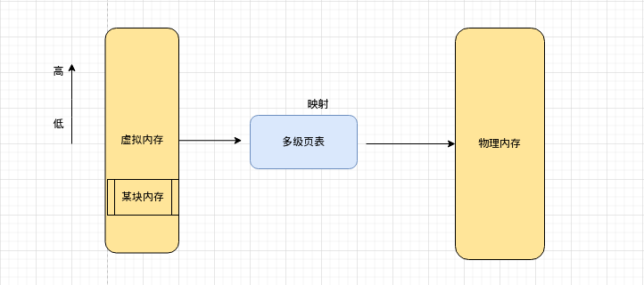
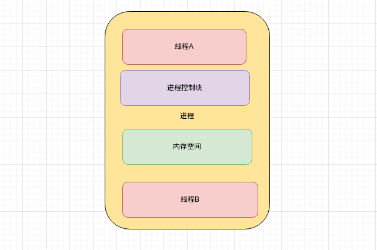
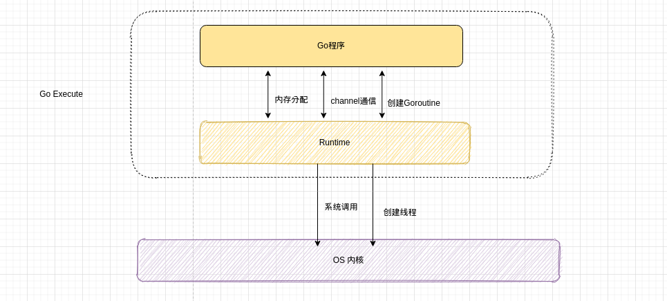
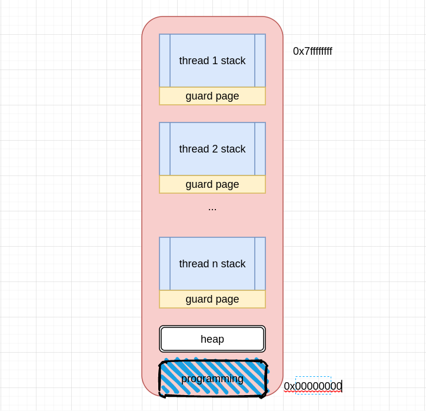
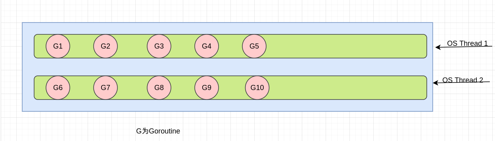
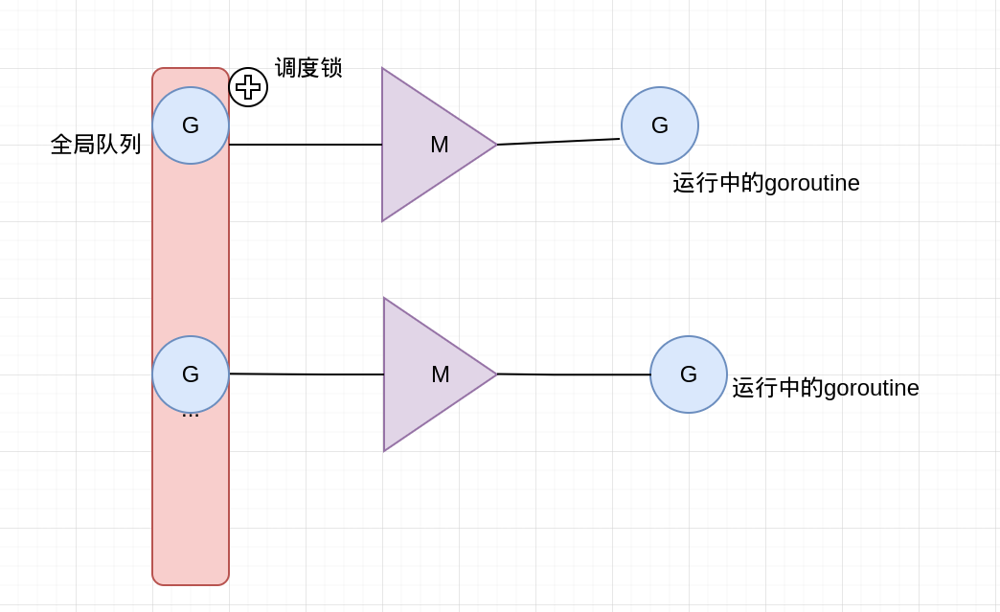
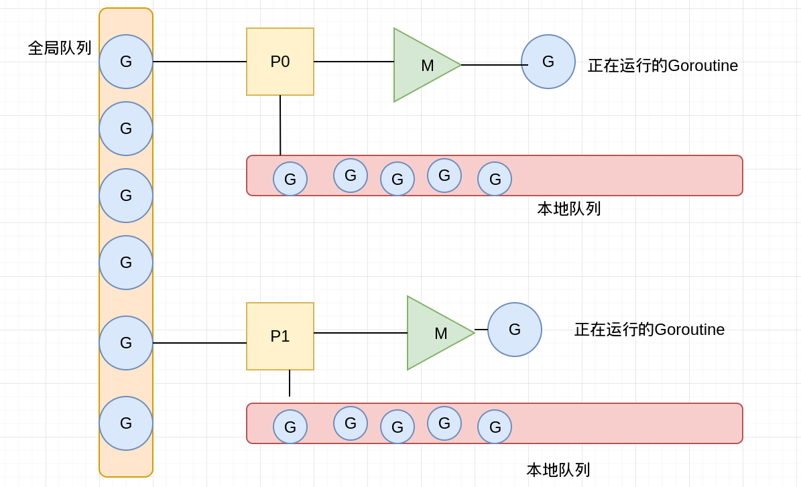

##### 进程和线程

对于用户层面来说，进程就是一个正在运行的程序，线程就是程序里的一些并发的功能。

对于操作系统来说，进程是资源分配的最小单位，线程是cpu调度的最小单位。

1. 进程

   在启动一个程序时，操作系统会给该程序分配一块内存空间，对于程序看到的是一整块连续的内存空间，即称为虚拟内存空间，落实到操作系统内核则是一块一块内存碎片。为的是节省内核空间，方便对内存管理。这片内存空间，有划分为用户空间和内核空间，用户空间之用于执行用户程序的执行。若要执行各种IO操作，则会通过系统调用等进入内核空间进行操作。

   

2. 线程

   线程是一个执行单元，一个进行可以包含多个线程，只有拥有了线程的进程才会被cpu执行，所以一个进程至少拥有一个主线程。

   多个线程可以共享同一个进程的内存空间，线程的创建不需要额外的虚拟内存空间，线程之间的切换也就少不了进程切换的切换页表，切换虚拟地址空间此类的巨大开销。至于为什么需要如此大的开销，这是因为进程的切换需要保存当前寄存器，栈，代码段，执行位置等信息。线程的切换执行保存切换的上下文，保存线程执行的上下文即可。例如保存在该线程里的栈信息，cpu把栈指针，指令寄存器的值指向下一个线程等。

   

##### 什么是Goroutine？

Goroutine是一个与其他Goroutine并行运行在**同一块地址空间的Go函数或方法**。一个运行的程序由一个或多个Goroutine组成。它与线程，进程，协程等不同。即Goroutine在同一用户地址空间里并行独立执行functions，channels则是用户goroutine之间的通信和同步访问控制。

##### Goroutine和线程的区别

1. 内存占用

   创建一个goroutine的栈内存消耗为2kb(Linux AMD64 Go1.4后)，运行过程中，如果栈空间不够用，会自动扩容。

   创建一个thread为了尽量避免极端情况下操作系统线程栈的溢出，默认会为其分配一个较大的栈内存(1-8MB栈内存，线程标准POSIX thread)，而且还需要一个称为"guard page"的区域用于其他thread的栈空间进行隔离。而栈空间一旦创建和初始化完成之后其大小就不能再有变化，这决定了在某些特殊场景下系统线程还是有溢出的风险。

   

2. 创建和销毁

   线程的创建和销毁都会有巨大的消耗，是内核级的交互(trap)

   POSIX线程(定义了创建和销毁线程的一套api)通常是在已有的进程模型中增加的逻辑扩展，所以线程控制和进程控制相似。而进入内核调度所消耗的性能代价比较高，开销较大。goroutine是用户态线程，是有go runtime管理，创建和销毁的消耗非常小。

3. 调度和切换

   线程切换会消耗1000-1500纳秒(上下文保存成本高，较多寄存器，公平性，复杂时间计算统计)，一个纳秒平均可以执行12-18条指令。所以由于线程切换，执行指令的条数会减少12000-18000。goroutine的切换约为200ns(用户态，3个寄存器)，相当于2400-3600条指令。因此，goroutine切换的成本比thread要小得多。

4. 复杂性

   线程的创建和推出复杂，多个thread间通讯复杂

   不能大量创建线程，成本高，使用网络多路复用，存在大量callback。对于应用服务线程门槛高，例如需要做第三方库隔离，需要考虑引入线程池等。

##### M:N模型

Go创建M个线程(CPU执行调度的单元，内核的task_struct)，之后创建的N个goroutine都会依附在这个M个线程上执行，即M:N模型。它们能够同时运行，与线程类似，但相比执行非常轻量。因此，程序运行时，Goroutines的个数应该是远大于线程的个数的。

同一时刻，一个线程只能跑一个goroutine。当goroutine发生阻塞(channel阻塞，mutex，syscall等等)时，go会把当前的goroutine调度走，让其他goroutine来继续执行，而不是让线程阻塞休眠，尽可能多的分发任务出去，让cpu忙。

##### GMP模型的演进历程

1. GMP概念

   G: goroutine的缩写，每次go func()都代表一个G，无限制。使用struct runtime.g，包含了当前goroutine的状态，堆栈，上下文。

   M: 工作线程(OS Thread)也称为Machine，使用struct runtime.m，所有M是有线程栈的。如果不对该线程栈提供内存的话，系统会给该线程提供内存(不同操作系统提供的线程栈大小不同)。当指定了线程栈，则M.stack->G.stack，M的pc寄存器指向G提供的函数，然后去执行。

   P: Processor是一个抽象的概念，并不是真正的无力cpu。它代表了M所需的上下文环境，也是处理用户级代码逻辑的处理器。它负责衔接M和G的调度上下文，将等待执行的G与M对接。当p有任务时需要创建或者唤醒一个M来执行它队列里的任务。所以P/M需要进行绑定，构成一个执行单元。P决定了并行任务的数量，可通过runtime.GOMAXPROCS来设定。在Go1.5之后GOMAXPROCS被默认设置可用的核数，而之前则默认为1。.

2. GM调度器

   Go1.2之前的调度器实现，限制了Go并发程序的伸缩性，尤其是对那些有高吞吐或并行计算需求的服务程序。每个goroutine对应于runtime中的一个抽象结构:G，而thread作为物理cpu的存在被抽象为一个结构体M。当goroutine调用了一个阻塞的系统调用，运行这个goroutine的线程就会被阻塞，这是至少应该再创建/唤醒一个线程来运行别的没有阻塞的goroutine。线程这里可以创建不止一个，可以按需不断创建，而活跃的线程(处于非阻塞状态的线程)的最大个数存储在变量GOMAXPROCS中。

   

3. GM调度模型存在的问题

   * 单一全局互斥锁和集中状态存储。这导致所有goroutine相关操作，比如: 创建，结束，重新调度等都要上锁。

   * Goroutine传递问题。M经常在M之间传递可运行的goroutine，这个导致调度延迟增大以及额外的性能损耗(刚刚创建的G放到全局队列，而不是本地M执行，不必要的开销和延迟)
   * Per-M持有内存缓存(M.mcache)。每个M持有mcache和stackalloc，然而只有M运行Go代码时才需要使用的内存(每个mcache可以高达2mb)，当M在处于syscall时并不需要。运行Go代码和阻塞在syscall的M的比例高达1:100，造成了很大的浪费。同时内存的亲缘性也较差，G当前在M运行后对M的内存进行了预热，因为现在G调度到同一个M的概率不高，数据局部性不好。
   * 严重的线程阻塞/解锁。在系统调用的情况下，工作线程经常被阻塞和取消阻塞，这增加了很多开销。比如M找不到G,此时M就会进入频繁阻塞/唤醒来进行检查的逻辑，以便及时发现新的G来执行。

4. GMP调度模型的引入

   在这个调度模型中引入了本地队列(local queue)，因为P的存在，runtime并不需要做一个集中式的goroutine调度，每一个M都会在P‘s local queue，global queue或其他P队列中寻找G来执行，减少全局锁对性能的影响。需要注意的是P的本地G队列还是可能面临一个并发访问的场景，为了避免加锁，这里P的本地队列是一个LockFree的队列，窃取G时使用CAS原子操作来完成。

   

---

that's all