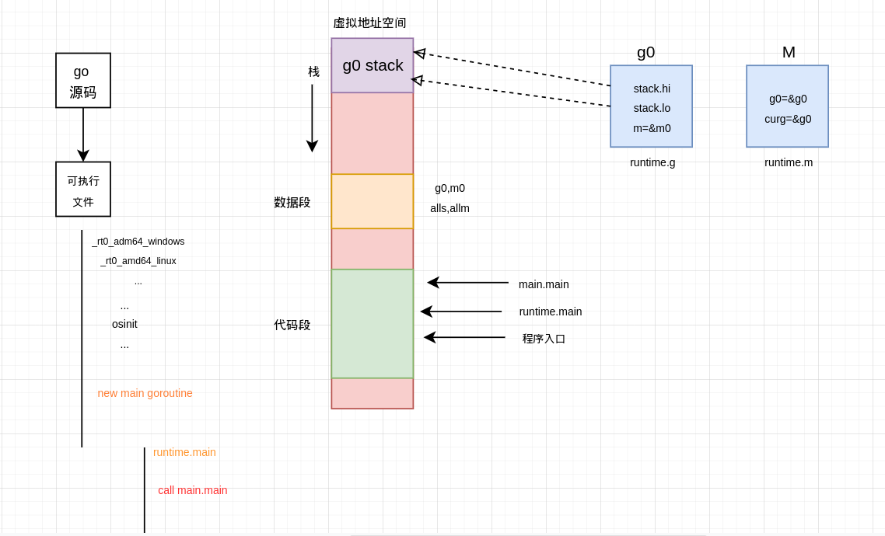
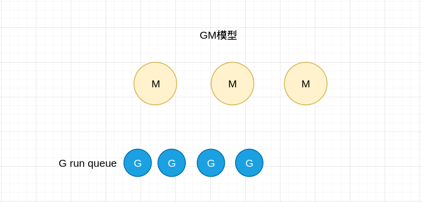
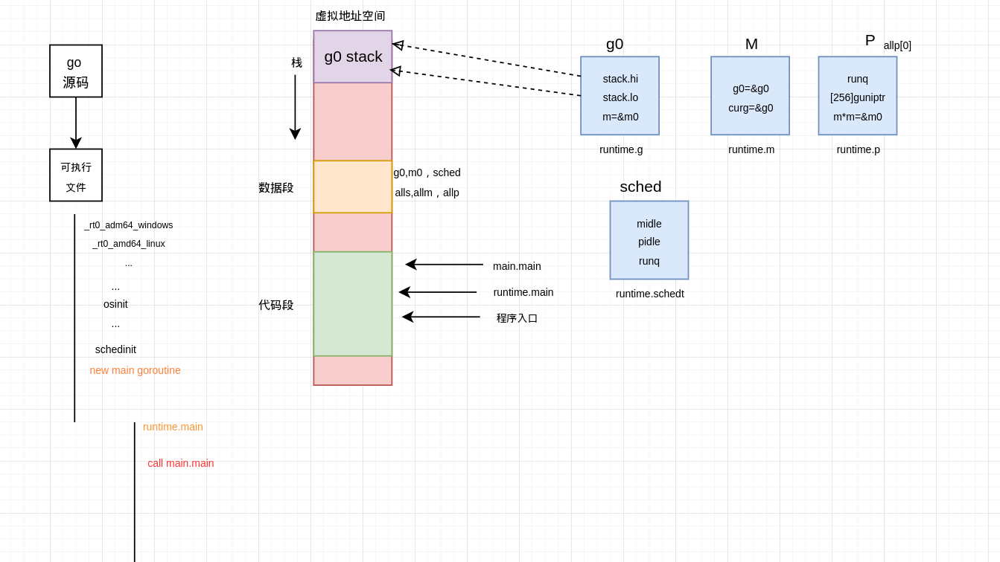
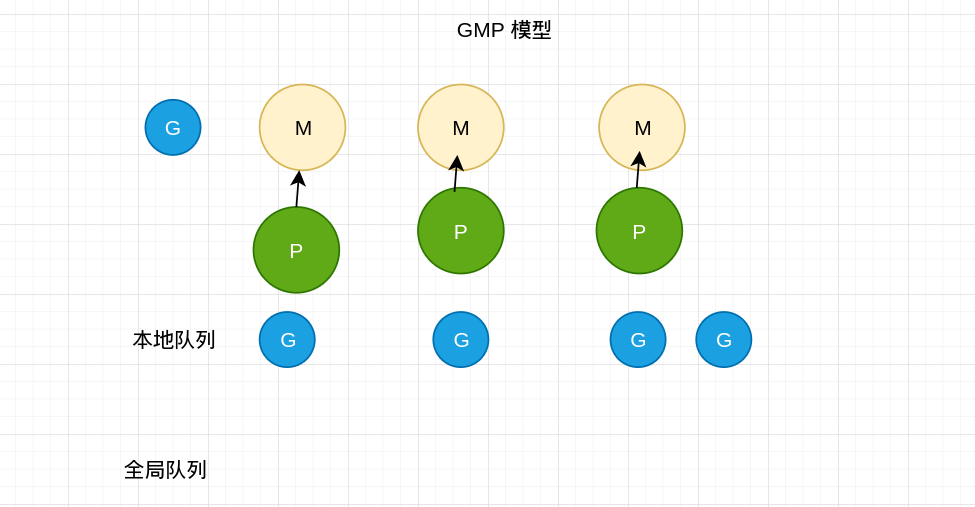
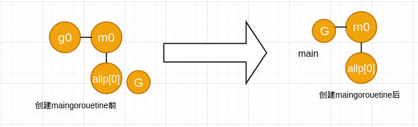
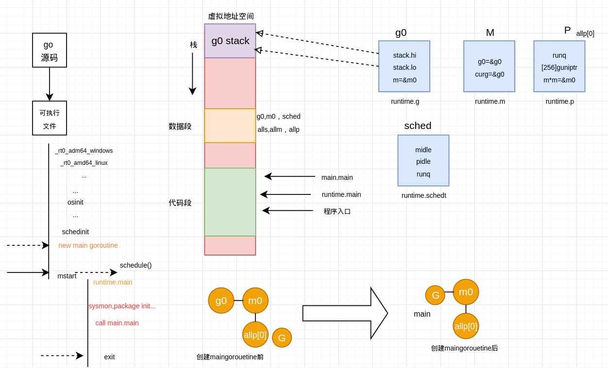
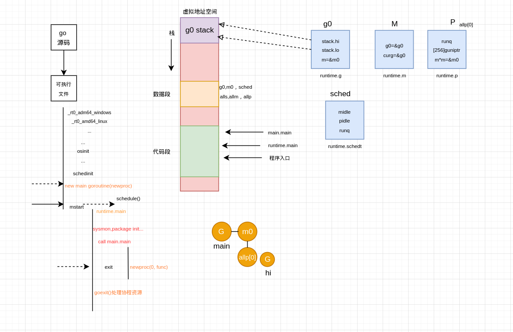

##### 从一个源码文件开始到GM模型

```go
package main

import "fmt"

func main() {
    fmt.Println("hi")
}
```

一个go源码文件被编译成一个可执行的二进制文件，执行时可执行文件被加载到内存，对于进程虚拟地址空间的代码段，我们感兴趣的是程序的入口，ta并不是我们熟悉的main.main。不同平台下程序执行入口不同，在执行了一系列的检查与初始化等准备工作后，会以runtime.main为执行入口创建main goroutine。runtime.goroutine执行起来后才会调用我们编写的main.main。再来看地址空间中的数据段，这里有几个全局变量不得不提及，我们知道Go中的协程对应的数据结构是runtime.g和工作线程中对应的数据结构runtime.m。而全局变量g0就是主协程中对应的g，与其他协程不同，它的协程栈实际上是在主线程上分配的。全局变量m0就是主协程对应的m。g0持有m0的指针，m0也持有g0指针，而且一开始m0上执行的协程正是g0。 m0和g0就是这样联系了起来。全局变量alls记录着所有的g,allm记录着所有的m。



Go最初的调度模型只有M和G,所以待执行的G,在全局队列中等待被运行。每个M来这里获取一个G时都要进行加锁操作，多个M分担多个G的执行任务就会因频繁的加锁解锁操作而发生等待影响并发性能。



##### 从GM到GMP

Go官方在GM的基础上加入了P，P对应的数据结构是runtime.p,他有个本地runq,这样只有将一个P关联到一个M,这个M就可以从P这里直接获取待执行的G,不用每次都和众多的M从一个全局队列中争抢任务了。也就是说，虽然P有一个本地队列runq,但是依然有一个全局队列runq,它保存在全局变量sched中，这个全局变量代表的是调度器，对应的数据结构是runtime.schedt,这里记录着所有空闲的m,空闲的p等等，许多调度相关的内容，其中就有一个全局的runq.如果本地队列已满，那么等待执行的G就会被放到这个全局队列里。而p会先从关联p持有的本地runq中获取待执行的G,如果没有的话，在到调度器持有的全局runq领取一些任务。如果全局runq中也没有了，就会去别的P那里"分担"一些G过来执行。同G和M一样，也有一个用于存放所有P的全局变量allp。在程序初始化过程中会进行调度器初始化，这时会按照GOMAXPROCS这个环境变量决定创建多少个P,保存在allp这个全局变量中，并且包第一个allp[0]与m0关联起来。所以G,M和P就这样的合作关系。





在main.goroutine创建前，G,P,M如下图所示，main.goroutine被创建后被加入到当前P的本地队列中，然后通过mstart函数开启调度循环。这个mstart函数是所有工作线程的入口，主要是调用schedule函数，即开启调度循环。其实对于一个活跃的M而言，不是在执行某个G,就是在执行调度程序获取某个G。队列里只有main.goroutine等待执行所以m0切换到main.goroutine，执行入口自然是runtime.main他会做很多事情，包括创建监控线程，进行包初始化等其中包括我们熟悉的main.main。在main.main返回后runtime.main会调用exit函数结束进程。





##### 以Goroutine的方式启动程序

```go
package main

import "fmt"

func hi() {
    fmt.Println("hi")
}

func main() {
    go hi()
}
```

如果一个在main.main中启动一个goroutine,那么会到main.main被调用时，就会创建一个新的goroutine。在Golang中我们可以使用go关键字创建协程，会被编译器转换为newproc函数调用，main.goroutine也就是用newproc函数创建的。创建goroutine时我们只需负责指定入口，参数。而newproc会给goroutine构造一个栈帧，目的是让协程任务结束后，返回到goexit函数中进行协程资源回收处理等工作。一个协程任务完成后，是该放到空闲G队列里备用，还是释放，总归要有个出路。如果我们设置GOMAXPROCS之创建一个P,新创建的goroutine被添加到当前P的本地runq,然后main.main就结束返回了，在然后exit函数被调用进程结束了，然后就没有然后了，所以新创建的goroutine他没能执行。问题就在于main.main返回后，exit函数就被调用直接包进程结束掉，没给新创建的goroutine空出调度时间。所以想要让新创建的goroutine执行就需要在main.main返回之前拖延下时间。例如使用time.Sleep(), 空select{}等。



```go
package main

import (
	"fmt"
    "time"
)

func hi() {
    fmt.Println("hi")
}

func main() {
    go hi()
    
    time.Sleep(time.Second * 5)
}
```

如果使用time.Sleep(),实际上会调用gopark函数，把当前协程的状态从`_Gruning`修改为`_Gwaiting`,然后main.goroutine不会回到当前P的runq中，而是在timer中等待继而调用schedule进行调用hi gooutine得以执行，等sleep时间到达后，timer会吧main.goroutine重新置为`_Grunable`状态放回到P的runq中，再然后main.main结束，exit得以调用进程推出，这是只有一个P的情况。

如果创建了多个P,hi goroutine创建之后，虽然默认会添加到当前P的本地队列里，但是，在有空闲P的情况下就可以启动新的线程关联到这个空闲的P,并把hi goroutine放在它的本地队列中了，同样的可以使用time.sleep或者使用一个channel又或者使用waitgroup,反正执行main.main不马上返回，hi goroutine就i有时间可以执行。


---

that's all