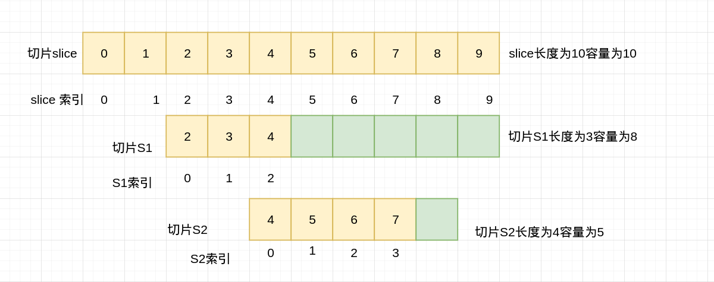
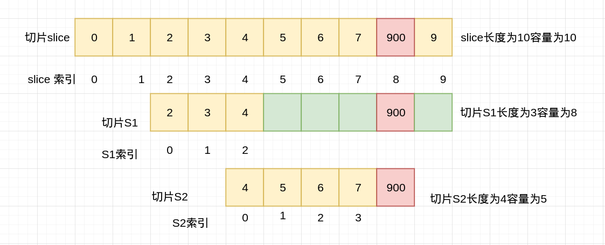
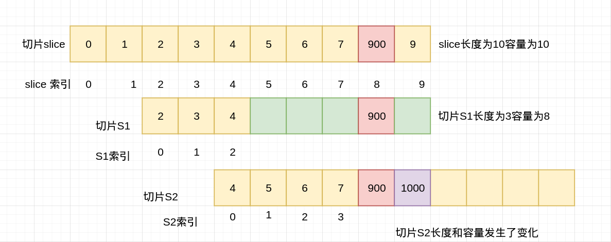

##### 数组和切片的异同

1. 切片本质是对数组的封装，它描述了一个数组的片段。和数组一样可以用下标来访问单个元素。
2. 数组是固定长度的，长度定义好之后，不能再更改。数组其长度属于类型的一部分，例如[3]int和[4]int是两个不同类型数组，因此两个不同长度的同类型数组不能进行比较。
3. 切片可以动态地扩容，且其类型和长度无关。
4. 数组一片连续的内存，切片实际上是一个结构体，其包含三个字段，长度，容量，指向底层数组的指针。

```go
// https://github1s.com/golang/go/blob/master/src/runtime/slice.go#L15-L19
type slice struct {
	array unsafe.Pointer // 指向底层数组的指针
	len   int // 长度
	cap   int // 容量
}
```

5. 底层数组可以被多个切片同时指向，因此对一个切片的元素进行操作有可能会影响到其他切片。

##### 切片的截取操作

1. 截取是一种比较常见的创建切片的方法，您也可以从数组或其他切片中进行截取操作，但需要指定起止的索引位置。
2. 基于已有的slice创建的新slice对象，被称之为reslice。新老slice公用底层数组，新老slice对底层数组的更改都会影响到彼此。同样的，基于数组创建的新slice也是同样的效果。
3. 如果因为执行了append操作使得新slice或老slice底层数组发生了扩容，则两者就不会相互影响。即问题的关键在于两者是否会公用底层数组。

```go
package main

func main() {
    slice := []int{0, 1, 2, 3, 4, 5, 6, 7, 8, 9}
    s1 := slice[2:5]
    s2 := s1[2:6:7]
    s2 = append(s2, 100)
    s2 = append(s2, 200)
    s1[2] = 10
    println(s1)
    println(s2)
    println(slice)
}
```

```bash
➜  slice go run main.go 
[2 3 10]
[4 5 6 7 100 200]
[0 1 2 3 10 5 6 7 100 9]
```



对于切片slice是一个长度为10容量为10的切片

切片S1从slice索引为2开始取，到索引5结束(不包括索引5,开区间，实际上取到索引4)，其长度为3,容量为8（默认容量到数组结尾）2,3,4

切片S2对切片S1进行截取操作，从索引为2开始取，到索引为6（开区间，实际上取到索引5）,容量为7（开区间，实际上取到索引6）4,5,6,7

slice,S1和S2公用同一个底层数组(指向同一数组)，如果此时对S2进行append操作，此时，S2的容量刚好足够，可以直接追加元素，但是这一修改会修改原始数组对应位置的元素，如下图所示



如果在对S2进行append操作，此时由于S2的容量不够，则会导致S2进行扩容操作，即将原来的元素复制到新的位置，扩大自己的容量




如果再对切片S2再次进行append操作，对slice和S1再无影响，即S2跟slice和S1指向的底层数组不是同一个了


----

that‘s all

