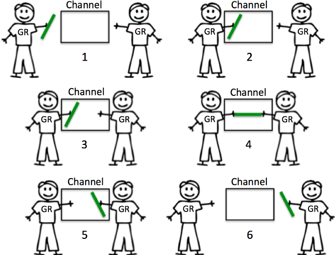
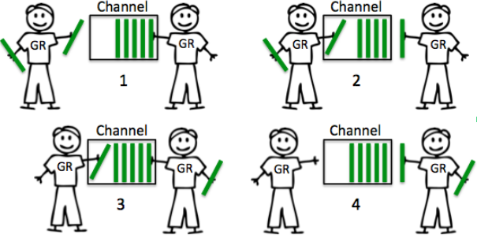

##### Channel

Channel是Go内置的数据类型，用于两个不同的Goroutine之间传递数据，是一种类型安全的消息队列。

##### Channel分类

根据是否有缓冲区可将channel分为两种: 无缓冲Channel和带缓冲Channel。

##### 无缓冲的Channel

1. 创建一个无缓冲区的Channel

   ```go
   unbuffer := make(chan struct{})
   ```

2. 无缓冲的channel没有容量，所以两个Goroutine在使用无缓冲channel进行消息传递是，通信双方必须同时准备好。如下图所示

   


3. 无缓冲的channel本质是保证通信同步。

4. 例子：

   ```go
   package main
   
   import (
       "time"
       "sync"
   )
   
   func main() {
       // 创建一个个无缓冲channle
       unbufferchannel := make(chan string)
       
       var wg sync.WaitGroup
       
       wg.Add(1)
       
       go func() {
           defer wg.Done()
           unbufferchannel<-"hello"
       }()
       
       go func() {
           defer wg.Done()
           println("Message: " + <-unbufferchannel)
       }()
       
       wg.Wait()
   }
   ```

   

##### 带缓冲的Channel

1. 创建一个带缓冲的channel

   ```go
   bufferchannel := make(chan string, 2)
   ```

2. 带缓冲的channel是一种在被接收前能存储一个或者多个值的通道。这种类型的channel并不强制要求goroutine之间必须同时完成发送和接收。如下图所示

   


##### Channel使用场景

channel一般的使用场景是用于耗时工作，类似生产这-消费者模式


##### Channel小总结

1. 无缓冲的channel接收者先于发送者发生。
2. 无缓冲可以保证100%接收者能接收到。
3. 无缓冲channel时间延迟是未知的。
4. 有缓冲的channel发送者是先发生与接收者的。
5. 有缓冲的channel时间延迟小，不保证数据是否可到达，越大的buffer，越小的保障。buffer为1时，给你延迟一个消息的保障。


---

that's all

