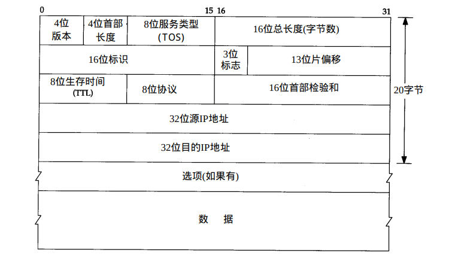

##### IP:网际协议

1. 不可靠性:

   不保证IP数据能正确的到达目的地，即IP仅提供最好的传输服务。可靠性应由上层来提供。

2. 无链接:

   IP并不维护任何后续数据报的状态信息，即每个数据的处理是相互独立的。IP数据报可以不按发送顺序接受。

Note:IP协议处理错误的一个简单算法是，丢弃当前数据包，然后发送ICMP消息报文给信源端

##### IP数据包格式

1. 4位版本号:IP协议的版本号，默认为IPv4
2. 4位首部长度:是一个首部占32bit字的数目，包括任何选项。由于它是一个4比特字段，因此首部长度最长位60个字节
3. 8位服务类型:包括一个3bit的优先权子字段，4bit的TOS子字段和1bit未用位但必须置0。4 bit的TOS分别代表:最小时延、最大吞吐量、最高可靠性和最小用。4 bit中只能置其中1 bit。如果所有4 bit均为0，那么就意味着是一般服务。 

4. 16位总长度:指整个IP数据报的长度，以字节为单位。利用首部长度字段和总长度字段， 就可以知道IP数据报中数据内容的起始位置和长度。由于该字段长 16比特，所以IP数据报最长可达 65535字节。
5. 标识字段: 唯一地标识主机发送的每一份数据报。通常每发送一份报文它的值就会加 1。
6. TTL生存时间字段设置了数据报可以经过的最多路由器数。它指定了数据 报的生存时间。TTL的初始值由源主机设置（通常为 3 2或6 4），一旦经过一个处理它的路由器，它的值就减去1当该字段的值为0时，数据报就被丢弃，并发送ICMP报文通知源主机。
7. 首部检验和字段是根据I P首部计算的检验和码。它不对首部后面的数据进行计算。 ICMP、 IGMP、UDP和TCP在它们各自的首部中均含有同时覆盖首部和数据检验和码。

Note:为了计算一份数据报的IP检验和，首先把检验和字段置为 0。然后，对首部中每个 16 bit 进行二进制反码求和（整个首部看成是由一串16bit的字组成），结果存在检验和字段中。当收到一份I P数据报后，同样对首部中每个16 bit进行二进制反码的求和。由于接收方在计算过程中包含了发送方存在首部中的检验和，因此，如果首部在传输过程中没有发生任何差错， 那么接收方计算的结果应该为全 1。如果结果不是全1（即检验和错误），那么IP就丢弃收到的数据报。但是不生成差错报文，由上层去发现丢失的数据报并进行重传。

---

that's all