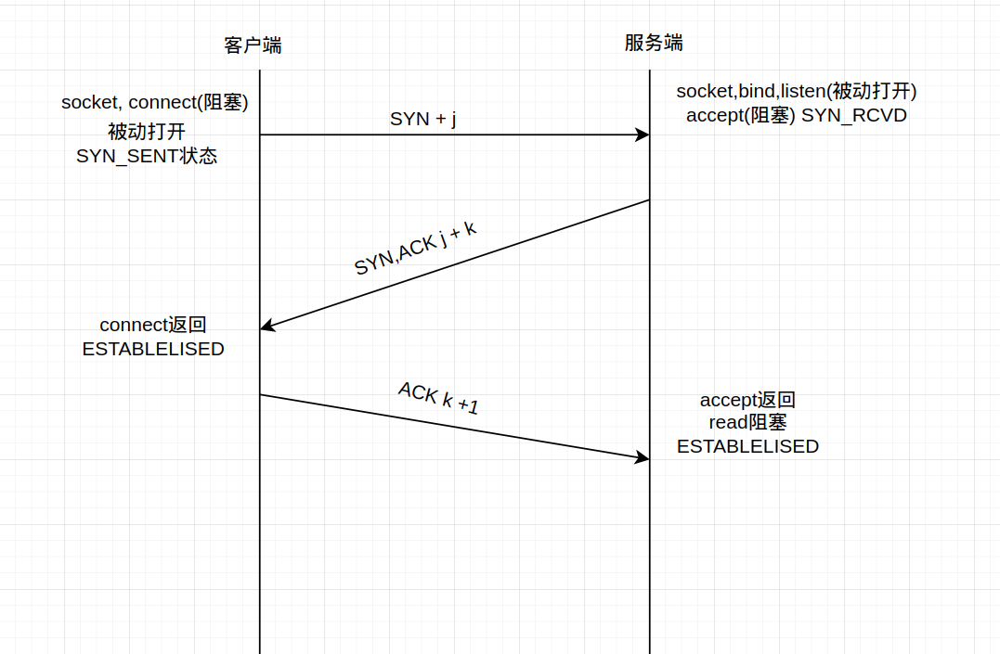
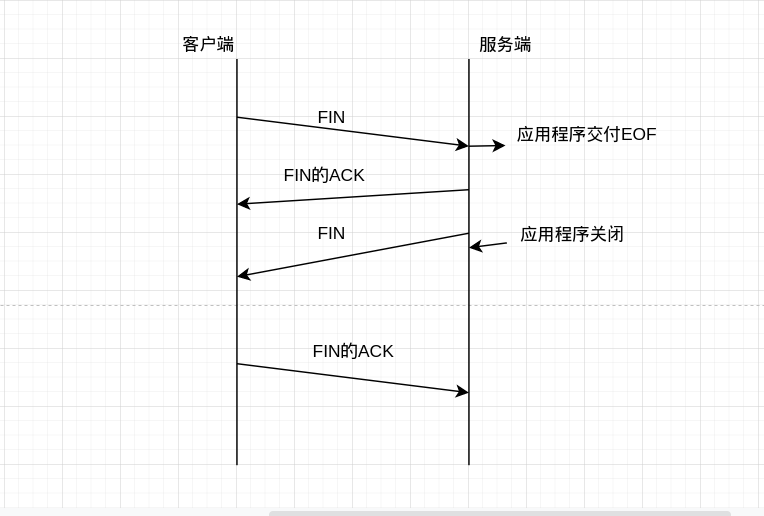

##### TCP的三次握手

tcp三次握手过程示意图如下所示：

tcp三次握手过程文字表示：

首先客户端的协议栈向服务器端发送了SYN包，并告诉服务器端当前发送序列号，此时客户端就进入到了SYN_SENT状态。服务器端的协议栈在接收到这个包后和客户端进行ACK应答，应答的值为j+1，表示对SYN包的确认，同时服务器端也会发送一个SYN包，告诉客户端当前我发生的序列号为k,服务端进入到SYN_RCVD状态。客户端协议栈收到ACK后，使得应用从connect调用返回，表示客户端到服务器单向连接建立成功，客户端的状态转为ESTABLELISED状态，同时客户端协议栈也会对服务器的SYN包进行应答数据为k+1。应答包到达服务器端后，服务器端协议栈使得accept阻塞调用返回，这时服务器端到客户端的单向连接成功，服务器端也进入了ESTABLELISED状态。

##### TCP的四次挥手

tcp发起连接需要经过三次握手，而断开连接则需要四次挥手

首先，一方应用程序调用close,我们称该方法为主动关闭，该端（这里指的是主机A）发送一个FIN包，表示要关闭连接。之后主动关闭方进入到FIN_WAIT_1状态，接着，接收到这个FIN包的对端（这里指定的是主机B）执行被动关闭，这个FIN包由TCP协议栈处理。我们知道TCP协议栈为FIN包插入一个文件结束符EOF到接收缓冲区中，应用程序可以通过read调用来感知到这个FIN包，这个EOF会被放在排队等候的其他已接收的数据之后，这意味着接收端应用程序需要处理，这种异常情况，因为EOF表示在该连接上再无额外数据。此时被动关闭方进入CLOSE_WAIT状态。接下来，被动关闭方将读到这个EOF.于是应用程序也调用close关闭它的套接字，这导致它的tcp也发送一个FIN包，这样被动关闭方将进入LAST_ACK状态。最终主动关闭方接收到对方的FIN包，并确认这个FIN包，主动关闭方进入TIME_WAIT状态，而接收到ACK的被动关闭方则进入close状态，至此完成四次挥手。

---

that's all