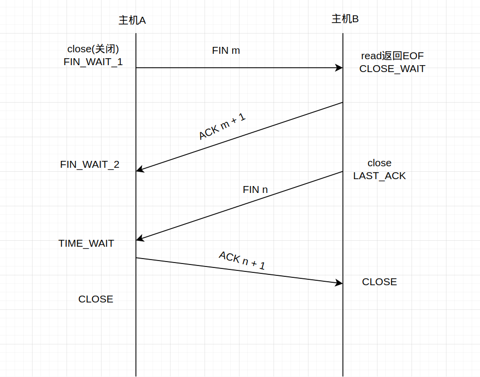

##### TCP的三次握手

tcp三次握手过程示意图如下所示：

tcp三次握手过程文字表示：

首先客户端的协议栈向服务器端发送了SYN包，并告诉服务器端当前发送序列号，此时客户端就进入到了SYN_SENT状态。服务器端的协议栈在接收到这个包后和客户端进行ACK应答，应答的值为j+1，表示对SYN包的确认，同时服务器端也会发送一个SYN包，告诉客户端当前我发生的序列号为k,服务端进入到SYN_RCVD状态。客户端协议栈收到ACK后，使得应用从connect调用返回，表示客户端到服务器单向连接建立成功，客户端的状态转为ESTABLELISED状态，同时客户端协议栈也会对服务器的SYN包进行应答数据为k+1。应答包到达服务器端后，服务器端协议栈使得accept阻塞调用返回，这时服务器端到客户端的单向连接成功，服务器端也进入了ESTABLELISED状态。

##### TCP的四次挥手

建立一个连接需要三次握手，而终止一个连接要经过四次挥手，这由TCP的半关闭造成的。一个TCP连接是全双工，因此每个方向必须单独地进行关闭。这原则就是当一方完成它的数据发送任务后就能发送一个FIN来终止这个方向连接。当一端收到一个FIN，它必须通知应用层另一端几经终止了那个方向的数据传送。发送FIN通常是应用层进行关闭的结果。受到一个FIN之意味着在这一方向没有数据流动。一个TCP连接在收到一个FIN后仍能发送数据。

---

that's all