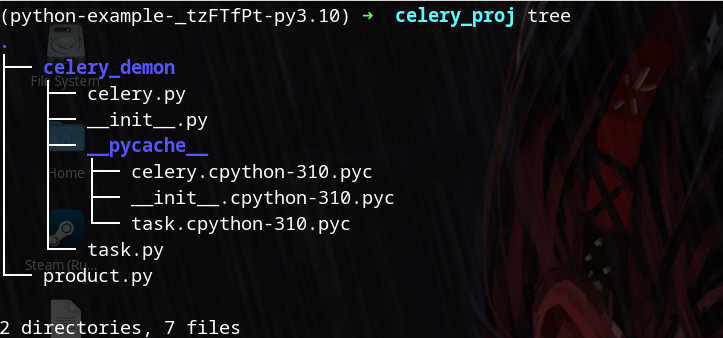

##### Celery简介

Celery是一款简单，灵活，可靠的分布式系统，可用于处理消息，并提供了一整套操作此系统的一系列工具

##### 安装Celery

```bash
pip install celery[redis]
```

##### Celery简单小案例

1. 创建如下目录



2. 在celery_demon/celery.py键入如下代码

```python
from celery import Celery

# 创建celery实例
celery_app = Celery(broker="redis://localhost:6379/0",
        backend="redis://localhost:6379/1",
        include=["celery_demon.task"])

```

3. 在celery_demon/task.py键入如下代码

```python
import time
from celery_demon.celery import celery_app

# 创建需要运行的任务
@celery_app.task
def send_email(name):
    print("pending ...")
    time.sleep(5)
    print("done ...")
    return "send success %s" % name
```

4. 在product.py键入如下代码

```python
from celery_demon.task import send_email

# 调用任务
result = send_email.delay("hello")
print(result.id)
```

6. 运行celery


7. 运行redis


8. 运行消费者程序


9. 运行结果


---


that's all