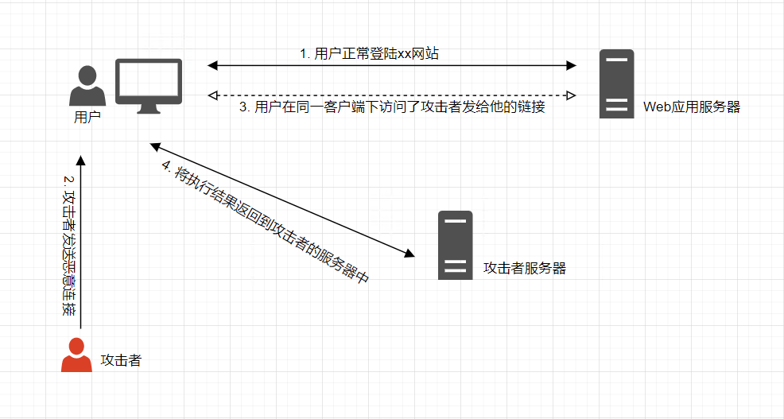
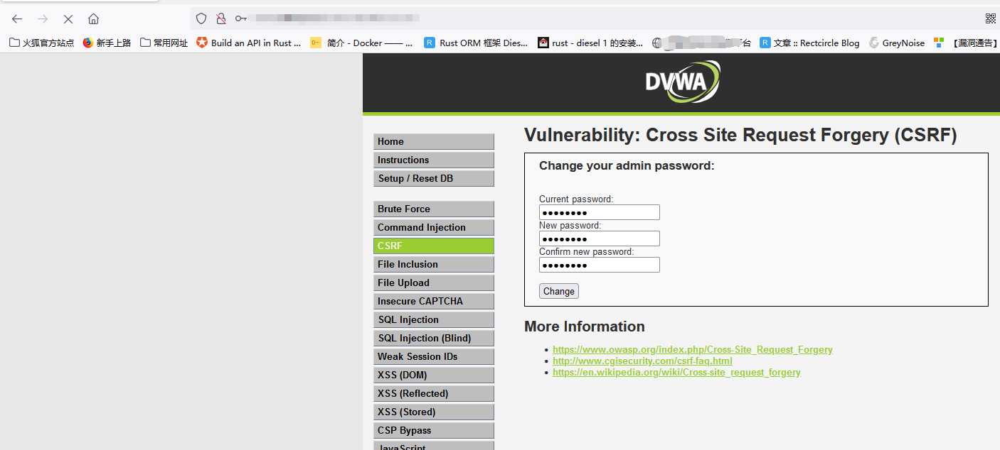
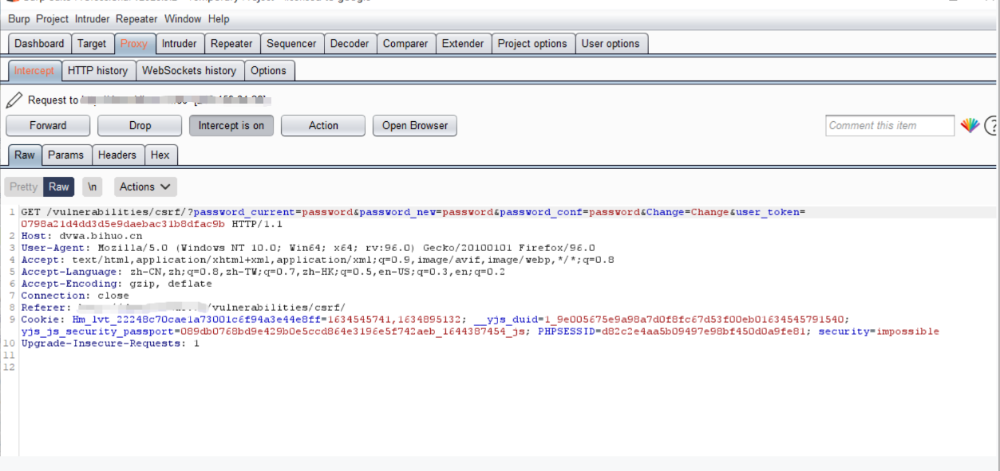
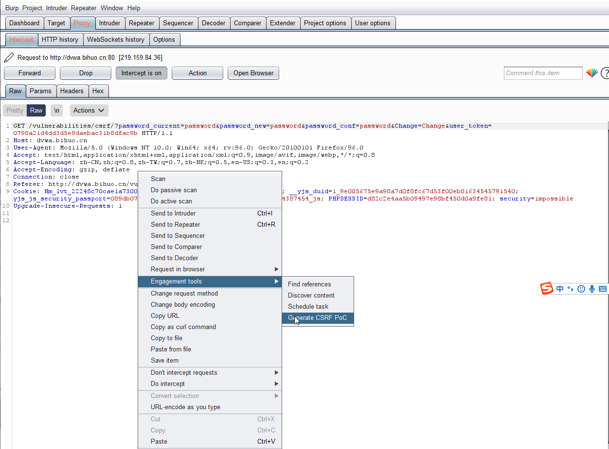
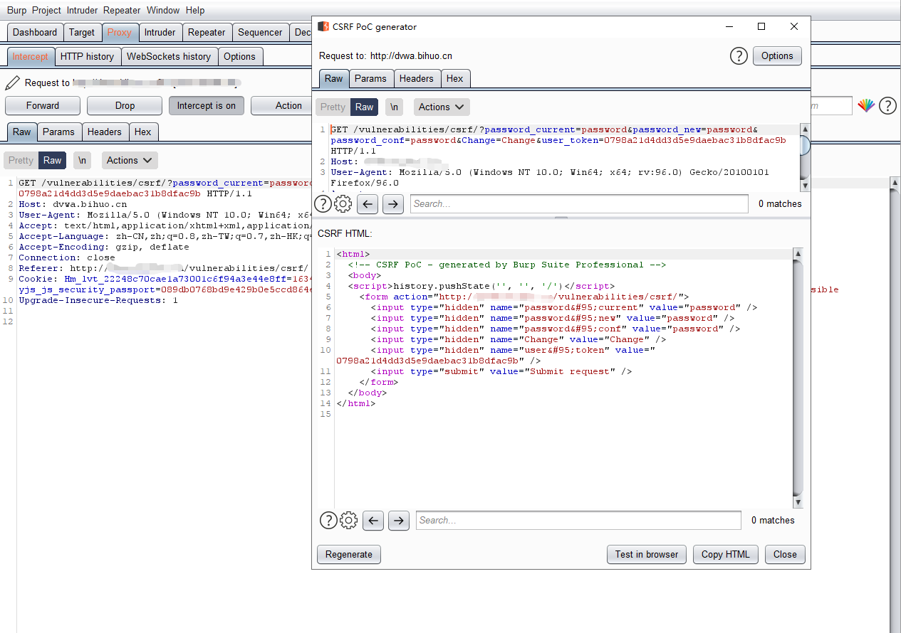
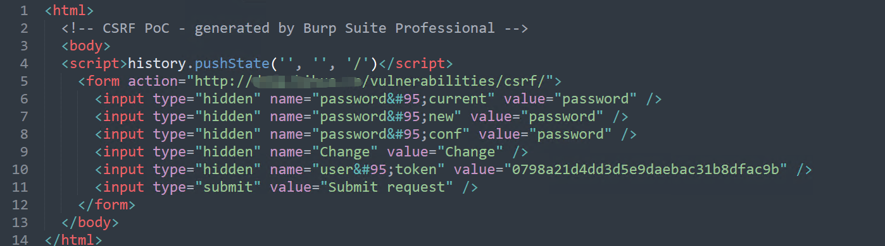
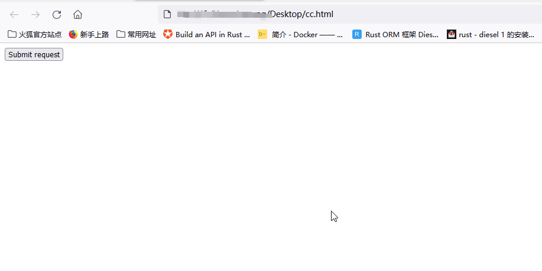
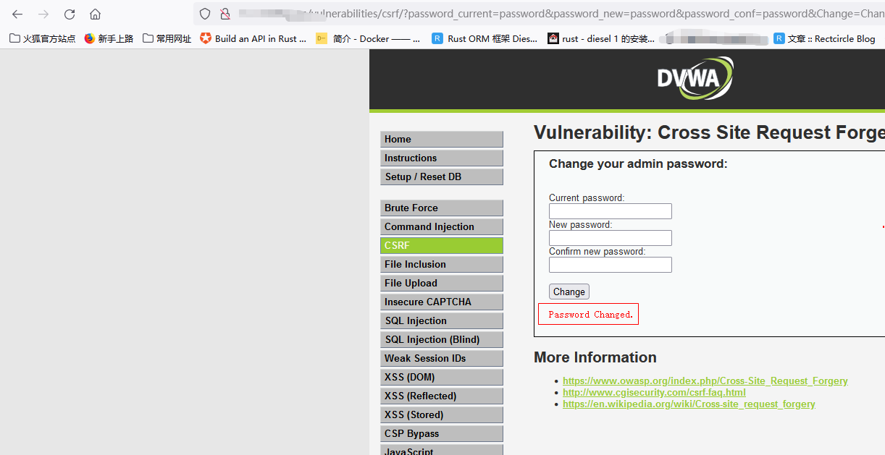

##### CSRF简介
跨站请求伪造,英语全称Cross-site request forgery,也被称为one-click attack或者session riding,通常缩写为 CSRF 或者 XSRF,是一种挟制用户在当前已登录的Web应用程序上执行非本意的操作的攻击方法。


##### CSRF攻击流程
CSRF大概的攻击流程如下图所示



##### CSRF类型
根据提交的方式不同,可分为GET型和POST型这两种类型

1. GET类型的CSRF,一般存在于URL中,例如
```bash
http://dvwa.vulnhub.com/api/pay/?price=100&accountID=20000000
```

2. POST类型的CSRF,一般存在Form表单中,构造恶意请求比GET类型的复杂.例如
```bash
<form action="http://dvwa.vulnhub.com/api/pay" method="POST">
	<input type="hidden" name="account" value="10000200" />
	<input type="hidden" name="price" value="2000" />
	<input type="hidden" name="submit" value="true" />
</form>

<script>
	document.forms[0].submit();
<script>
```

##### CSRF特点
1. 发起攻击的一般是在第三方网站,而不是被攻击的站点.被攻击的网站无法防止攻击的发生.
2. 攻击者利用受害者在被攻击网站的登录凭证,冒充受害者实施非法操作,而不是直接窃取用户数据.
3. 整个攻击过程中攻击者仅仅是冒用受害者的身份,而不能真正获取受害者的登录凭证.


##### CSRF与XSS的区别
CSRF和XSS经常会有人把两者给搞混了,下面来看看它们的区别吧!

两者的区别:
1. CSRF是冒用受害者身份进行非法操作,而XSS则可获取受害者的登录凭证,进而控制用户的会话.


##### CSRF防御
1. 检查Referer头部字段
2. 添加token验证
2. 添加验证码


##### 使用Burpsuite验证CSRF
这里使用的靶场环境未DVWA,测试工具为Burpsuite Pro版本

1. 打开靶场,安全等级调为low.选择CSRF项,输入测试账号数据,点击提交按钮.



2. 使用Burpsuite抓包(这里需要注意的是,需要提前在浏览器中设置好代理,并打开burpsuite的代理)



3. 右击当前面板,选择Engagement tools->Generate CSRF Poc,步骤如下图所示



4. 在弹出的面板中,点击Copy HTML或Test in browser按钮即可生成poc.(在这个面板中你可修改或增加任意的数据,Test in browser是立即在浏览器中打开poc).步骤如下图所示



5. 将第四步中Copy的结果保存为html格式的文件,这里我保存为cc.html



6. 在浏览器中打开cc.html文件(注意的是需要在同一浏览器中打开,否则poc无效)



7. poc执行成功,漏洞存在



---
that's all