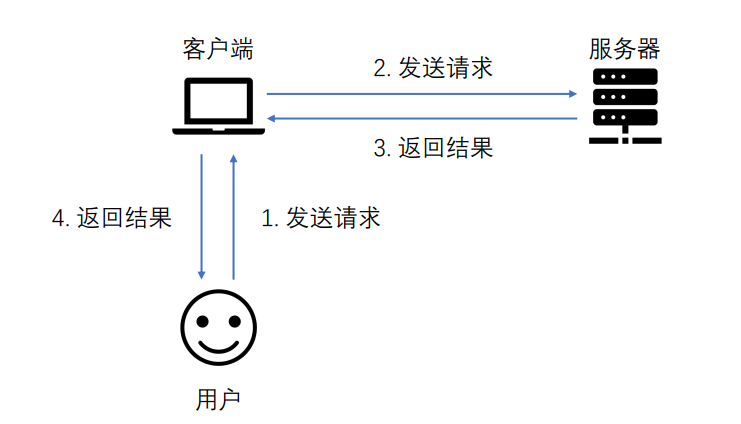
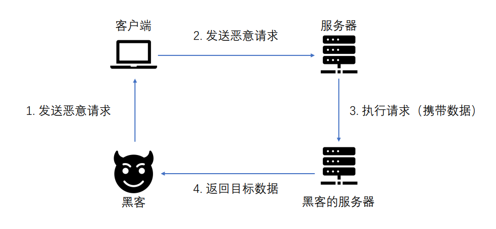

##### OOB简介

带外通道技术英文全称Out-Of-Band,简称OOB。带外通道技术让攻击者能够通过另一种方式来确认和利用没有直接回显的漏洞。这类漏洞的一个特点是攻击者无法通过恶意请求直接在响应包中看到漏洞的输出结果。带外通道技术通常需要脆弱的实体来生成带外的TCP/UDP/ICMP请求，然后攻击者可以通过这个请求提取数据。

##### OOB成功的条件

1. 存在漏洞的系统
2. 外围防火墙的出站请求

##### 带内和带外的区别

1. 带内通信即Inband 也叫常规通信信道，它的请求流程如下图所示:

2. 带外通信即OOB也叫非应用内信道，它的请求流程如下图所示:

---

that's all