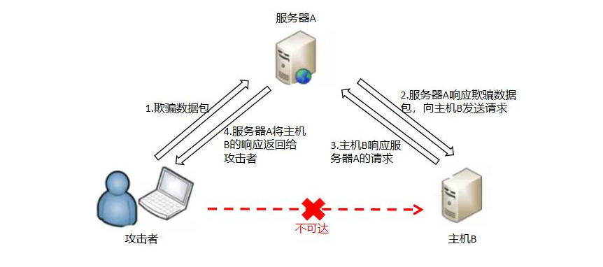

##### SSRF漏洞

SSRF英文全称为Server Side Request Forgery即服务端请求伪造，是一种由攻击者构造请求，由服务端发起请求的安全漏洞。

##### 攻击图示

特点:

1. 攻击者机器无法直接访问目标主机B的服务
2. 目标主机A能够访问目标主机B的服务
3. 攻击者需要借助主机A作为跳板机简介的访问主机B

##### 几种常见可能存在SSRF漏洞的位置

1. 图片加载与下载功能

   通过url地址远程加载或下载图片，常见于很多转载行为或远程加载

2. 本地处理功能

   业务流程中需要对用户输入的参数进行本地处理，如要获取提交的url中的header信息等，这类业务都会由服务器发起请求

3. 各种辅助类功能

   可针对用户输入的参数添加各类辅助信息，提升参数的可视化效果

4. 图片，文章收藏功能

   将远程地址进行本地保存，这样可让用户在重新发起请求访问时由服务器重新加载远程地址即可。

##### 漏洞危害

1. 对内网web应用特征进行发现
2. 对服务器所在的内网进行各类信息探测
3. 利用file协议读取本地文件
4. 针对特定目标进行攻击是隐藏攻击发起地址

##### 漏洞防御

1. 双向过滤用户端参数，严格限定输入参数，返回结果的数据类型及内容
2. 限制请求行为端口，并针对具有服务器请求业务的网络范围进行严格划分
3. 针对内网地址添加黑/白名单
4. 尽可能实现业务集中化调用，并尽量减少这类直接发起主动请求的业务行为

---

that's all