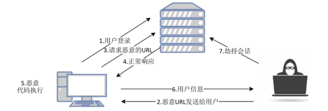
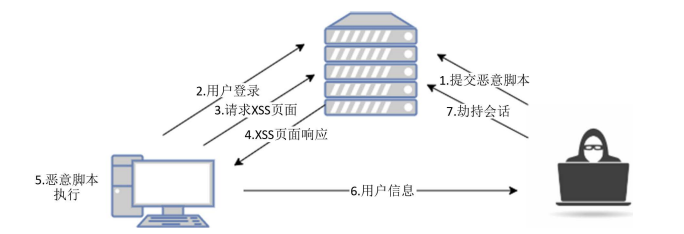
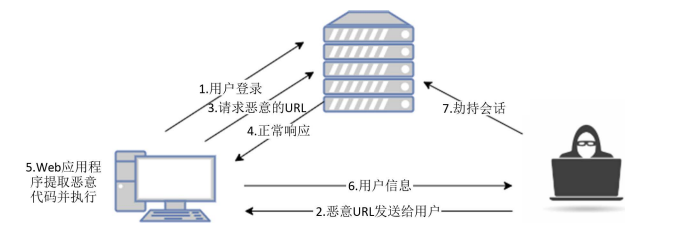

##### 反射型XSS

1. 特点

   a. 输入点通常在URL中

   b. 攻击持续时间和造成的危害一般较短

2. 攻击流程

   

a. 用户正常登录xxx网站--->b.攻击者发送恶意URL给xxx网站用户--->c. xxx网站用户点击恶意URL--->d. xxx网站用户请求恶意URL--->e. 网站正常响应--->f. 执行是恶意代码--->g. 攻击者获取用户信息--->h. 攻击者劫持xxx网站用户会话

##### 存储型XSS

1. 特点

   a. 输入点通常是存在于用户交互的地方，如搜索表单，网站留言板等

   b. 攻击持续时间和造成的危害一般比较长

2. 攻击流程

a. 攻击者向xxx网站提交恶意脚本，服务端未做任何过滤并将恶意脚本存储在数据库中--->b. 正常用户登录xxx网站--->c.xxx网站用户请求存在存储型xss漏洞页面--->d.xxx网站响应xss恶意页面---> e.执行恶意脚本---> f. 攻击者获取xxx网站用户信息---> h. 攻击者劫持xxx网站用户会话

##### DOM型XSS

1. 特点

   a. 由javascript的DOM节点编程可以改变HTML代码这个特性而形成的XSS攻击

   b. 持续时间和危害一般比较短和小

2. 攻击流程

   

   a. xxx网站用户登录xxx网站--->b. 攻击者发送恶意URL给xxx网站用户--->c. xxx网站请求恶意的URL--->d. xxx网站正常响应---> e. web应用程序提取恶意代码并执行---> f. 攻击者获取xxx网站用户信息---> g. 攻击者劫持xxx网站用户会话

---

that's all