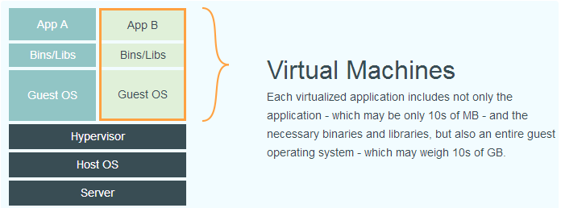
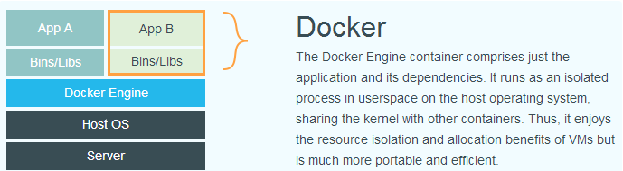

#### 什么是Docker

Docker能将应用用程序自动部署到容器的开源引擎。最初由dotColoud公司创始人Solomon Hykes在法国期间发起的一个公司内部项目，它是基于dotColoud公司多年云服务技术的一次革新，并于2013年3月以Apache2.0授权协议开源。

Docker使用Go语言进行开发实现，基于Linux内核的cgroup,namespace,以及OverlayFs类的Union FS等技术，对进程进行封装，属于操作系统层面的虚拟化技术。由于隔离的进程独立于宿主机和其他的隔离的进程，因此也称其为容器。

#### Docker与传统虚拟化技术的比较

1. 传统虚拟技术

2. docker

docker与传统虚拟化技术最明显的区别是，传统的虚拟化技术需要通过中间层(hypervisor)虚拟运行一套完整的操作系统。而docker则不需要，笼统的讲docker就是一个进程，而这个进程是在操作系统层面之上的用户空间上运行的。

---

that‘s all