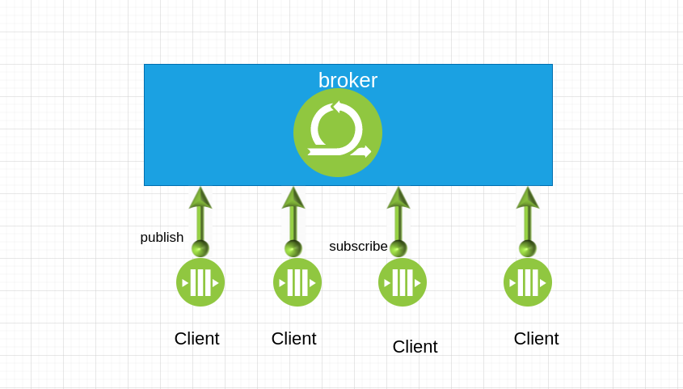
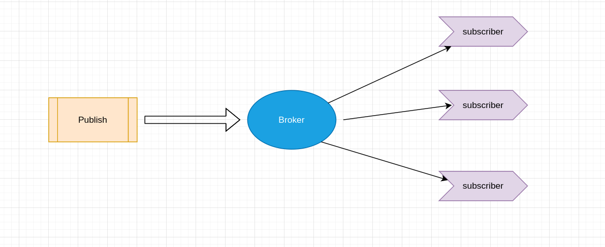

##### MQTT协议

> MQTT协议(message queue telemetry transport， 消息队列遥测传输协议)是IBM的Andy Stanford-Clark和Arcon的Arlen Nipper于1999年为了一个通过卫星网络连接输油管道项目开发的。为了满足低电量消耗和低网络带宽的需求，MQTT协议在设计上之初就包含以下特点
>
> 1. 实现简单
> 2. 提供数据传输的Qos
> 3. 轻量，占用带宽低
> 4. 可传输任意类型的数据
> 5. 可保持的会话

##### MQTT特性

1. 基于TCP协议的应用层协议
2. 采用C/S架构
3. 使用订阅/发布模式，将消息的发送方和接受方解耦
4. 提供3种消息的Qos(Quality to Service): 至多一次，最少一次，只有一次
5. 收发消息都是异步的，发送方不需要等待接受方应答

##### MQTT协议架构基本组成

##### MQTT与传统消息队列的区别

1. 传统消息在发送消息前必须先创建相应的队列。在MQTT协议中，不需要预先创建要发布的主题。
2. 传统消息队列中，未被消费的消息会被保存在某个队列中，直到有一个消费者将其消费。在MQTT中，如果发布一个没有被任何客户端订阅

的消息，这个消息将被直接扔掉。

3. 传统消息队列中，一个消息只能被一个客户端获取。在MQTT中，一个消息可以被多个订阅者获取，MQTT协议也不支持指定消息被单一的客户端获取。

##### MQTT协议的通信模型

MQTT协议的通信是通过发布/订阅的方式实现的，消息的发布方和订阅方通过这种方式解耦，它们之间没有直接连接，所以需要一个中间方来对消息进行转发和存储。在MQTT协议里，我们陈这个中间方为Broker,而连接到Broker的订阅方和发布方我们稱為Client。。

大概的通信流程分为如下几个过程

1. 发布方和订阅方都建立了到Broker的TCP连接
2. 订阅方告知Broker它要订阅的消息主题
3. 发布方将消息发送到Broker,并指定消息的主题
4. Broker接收到消息后，检查都有哪些订阅方订阅了这个主题，然后将消息发送到这些订阅方
5. 订阅方从Broker获取该信息
6. 如果某个订阅方此时处于离线状态，Broker可以先为保存此条消息，当订阅方下次连接到Broker的时候，再将之前的消息发送到订阅方

---

that's all