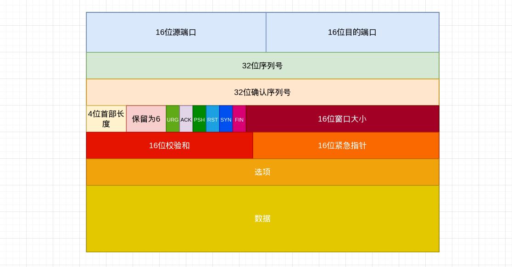

##### TCP协议

TCP提供了一种面向连接的，可靠的字节流服务。面向连接意味着两个使用TCP应用在彼此交换数据之前必须建立一个TCP连接。

##### TCP提供可靠型的方式

1. 应用数据被分割成TCP认为最适合发生的数据块。这和UDP完全不同，应用程序产生的数据长度将保持不变。由TCP传递给IP的信息单位称为报文段或者段。
2. 当TCP发出一个段后，它启动一个定时器，等待目的确认收到这个报文段。如果不能及时收到一个确认，将重发这个报文段。
3. 当TCP收到发自TCP连接另一端的数据，它将发送一个确认。这个确认不是立即发送，通常将推迟几分之秒。
4. TCP将保持它首部和数据的校验和。这是一个端到端的校验和，目的是检测数据在传输过程中的任何变化。如果收到段的检验和有差错，TCP将丢弃这个报文段和不确认收到此报文段。
5. TCP报文段作为IP数据报来传输，而IP数据报的到达可能会失序，因此TCP报文的到达也可能会失序。如果有必要，TCP将对收到的数据进行重新排序，将收到的数据以正确的顺序交给应用层。
6. IP数据报会发生重复，TCP的接收端必须丢弃重复的数据
7. TCP还能提供流量控制。TCP连接的每一方都有固定大小的缓冲空间。TCP的接收端只允许另一端发送接收端缓冲区所能接纳的数据。这将防止较快主机致使较慢主机的缓冲区溢出。

##### TCP的首部

##### TCP首部的数据格式

TCP首部数据格式字段介绍：

1. 每个TCP段都包含源端和目的端的端口号，用于寻找发送端和接收端应用进程。是唯一确定一个TCP连接。

2. 序列号用来标识从TCP发送端向TCP接收端的数据字节流，它表示在这个报文段中的第一个数据字节

3. 首部长度给出首部中32bit字数目。需要这个值是因为任选字段的长度是可变的。这个字段占4个bit，因此TCP最多有60字节的首部。

4. 在TCP首部中有6个标志比特。它们中的多个可同时被设置为1。URG：紧急指针，ACK：确认序号有效，PSH：接收方应该尽快将这个报文段交给应用层。

   RST：重建连接，SYN：同步序号用来发起一个连接。FIN：发送端完成发送任务

5. TCP的流量控制有连接的每一端通过声明的窗口大小来提供。窗口大小为字节数，起始于确认序号字段指明的值，这个值是接收端正期望接收的字节。窗口大小是一个16bit字段，因而窗口大小最大为65535字节。

6. 校验和覆盖了整个的TCP报文段：TCP首部和TCP数据。这是一个强制性的字段，一定是由发送端计算和存储，并由接收端进行验证。

---

that's

