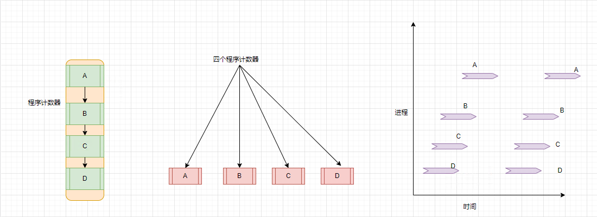
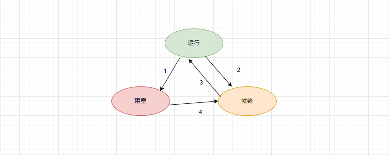

##### 进程模型
在进程模型中，计算机上所有可运行的软件，通常也包括操作系统，被组织成若干个顺序进程，简称进程。一个进程就是一个正在执行程序的实例，包括程序计数器，寄存器和变量当前的值。

##### 进程的创建
四种主要事件会导致进程的创建
1. 系统初始化
2. 正在运行的程序执行了创建进程的系统调用
3. 用户请求创建一个新的进程
4. 一个批处理作业的初始化

在UNIX系统中，只有一个系统调用可以用来创建新的进程: fork。这个系统调用会创建一个与调用进程相同的副本。在调用fork之后这两个进程拥有相同的内存映射，同样的环境字符串和同样的打开文件。通常，子进程接着执行execve或一个类似的系统调用，以修改其内存映射并运行一个新的程序。例如，当一个用户在shell中键入命令sort时，shell会创建一个子进程，然后这个子进程执行sort命令。之所以要分成两步来建立进程，是为了fork之后但在execv执行之前允许该子进程处理其文件描述符，这样可以完成对标准输出文件，标准输入文件和标准错误文件的重定向。

在windows中，情形是刚好相反的，一个win32函数调用CreateProcess既处理进程的创建，也负责把正确的程序装入新的进程里。该调用有10个参数，其中包括要执行的程序，输入给该程序的命令行参数，各种安全属性，有关打开的文件是否继承的控制位，优先信息，该进程所需创建的窗口规格以及指向一个结构体指针，在该结构体中新创建进程的信息被返回给调用者。

在UNIX和windows中，进程创建之后，父进程和子进程有各自不同的地址空间。如果其中某个进程在其地址空间中修改了一个字，这个修改对其他进程而言是不可见的。在UNIX中，子进程的初始化地址空间是父进程的一个副本，但是这里涉及两个不同的地址空间，不可写的内存区是共享的。某些UNIX的实现使程序正文在两者间共享，因为它不能被修改。或者，子进程共享父进程的所有内存，但是这种情况下内存通过写时复制(write on copy)共享，这意味着一旦两者之一想要修改部分内存，则这块内存首先被明确地复制，以确保修改发生在私有内存区域。再次强调，可写的内存是不可共享的。但是，对于一个新创建的进程而言，确实有可能共享其创建者的其他资源，诸如打开的文件等。在windows中，从一开始父进程的地址空间和子进程的地址空间就是不同的。

##### 进程的终止
跟人的生老病死类似，进程也有"死期"。通常能引起进程终止的条件有如下几种

1. 正常退出(自愿退出，即正常启动，正常退出)

2. 出错退出(自愿退出，即进程发现了错误，导致进程自愿退出)

3. 严重退出(非自愿退出，即由进程引起的错误，例如输入了一条非法指令，引用不存在的内存，或者除零错误)

4. 被其他进程杀死(非自愿退出，某个进程执行了系统调用通知操作系统杀死某个进程)

##### 进程的状态
进程有三种状态，如下图所示:

1. 运行态: 在该时刻进程实际占有CPU资源
2. 就绪态: 可运行，但因为其他进程正在运行而暂停运行
3. 阻塞态: 除非某种外部事件发生，否则进程不能进行

运行态和就绪态在逻辑上是类似的。处于这两种状态的进程都可以运行，只是对与第二种状态暂时没有CPU分配给它。
而第三种状态即阻塞态与前面两种状态不同，处于该状态的进程不能运行，即使CPU空闲也不行。

进程状态转换:

如果操作系统发现某个进程不能继续运行下去了就会发生转换1，即运行态转换为阻塞态

如果一个进程长时间占用CPU资源，操作系统会让其他进程使用CPU，这时则会发生转换2，即运行态转换为就绪态

在系统已经让所有其他进程享有了它们应有的公平待遇而重新轮询到第一个进程再次占有CPU运行时，就会发生转换3，即从就绪态转换为运行态

当一个进程在等待一个外部事件发生时，则会发生转换4，即阻塞态转换为就绪态

##### 进程的实现
为了实现进程模型，操作系统维护着一张表格，即进程表。每个进程占用一个进程表项(或叫进程控制块)。该表项包含了进程状态的重要信息，包括程序计数器，堆栈指针，内存分配状况，所有打开文件的状态，账号和调度信息，以及其他进程由运行态转换到就绪态或阻塞态时必须保存的信息，从而保证该进程随后能再次启动，就像从未被中断过。

---
that's all