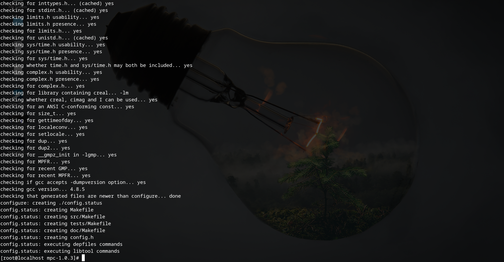

##### Centos7.8源码升级安装GCC

1. 先将ios格式的光盘上传至服务器，然后将其挂载到某个目录下

```bash
mount centos-7-x86_64-everything-2003.iso /mnt/1/ -o loop
```

2. 修改yum源

```bash
cd /etc/yum.repos.d/
ls
CentOS-Base.repo  CentOS-CR.repo  CentOS-Debuginfo.repo  CentOS-fasttrack.repo  CentOS-Media.repo  CentOS-Sources.repo  CentOS-Vault.repo  CentOS-x86_64-kernel.repo
mkdir bak
mv *.repo
CentOS-Base.repo           CentOS-Debuginfo.repo      CentOS-Media.repo          CentOS-Vault.repo          
CentOS-CR.repo             CentOS-fasttrack.repo      CentOS-Sources.repo        CentOS-x86_64-kernel.repo  
mv *.repo bak/
cp -r bak/CentOS-Base.repo install.repo


vim /etc/yum.repos.d/install.repo

[INSTALL]
name=INSTALLED
baseurl=file:///mnt/1
gpgcheck=0

```

3. 安装必要依赖的工具包

```bash
yum install -y gcc gcc-c++ gcc-gnat libgcc libgcc.i686 glibc-devel bison flex tesinfo build-essential zlib-devel
```


4. 下载4个GCC的依赖

下面4个包必须下载和安装

```bash
gmp-6.1.0.tar.bz2 isl-0.18.tar.bz2   mpc-1.0.3.tar.gz  mpfr-3.1.4.tar.bz2
```

5. 源码编译安装4个依赖包

```bash
cd gmp-6.1.0/
./configure --prefix=/usr/local/gmp-6.1.o
make && make install
```


中间如果出现如下错误，请修改mpn/m4-ccas的权限


```bash
cd mpfr-3.1.4/
./configure --prefix=/usr/local/mpfr-3.1.4 --with-gmp=/usr/local/gmp-6.1.0
make && make install
```


```bash
cd mpc-1.0.3/
./configure --prefix=/usr/local/mpc-1.0.3/ --with-gmp=/usr/local/gmp-6.1.0 --with-mpfr=/usr/local/mpfr-3.1.4

make && make install
```




```bash
cd isl-0.18/
./configure --prefix=/usr/local/isl-0.18/ --with-gmp-prefix=/usr/local/gmp-6.1.0

make && make install
```


---

that's all