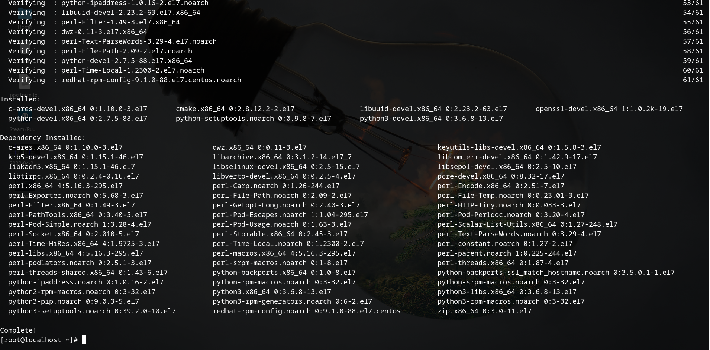
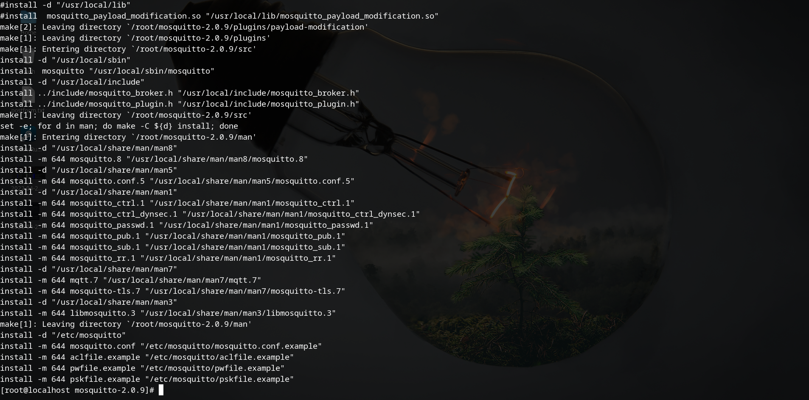
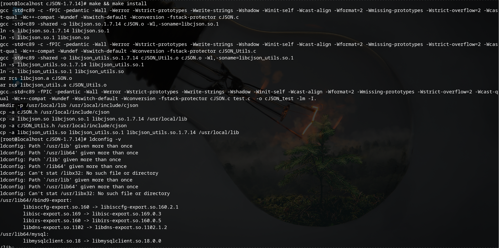

##### 说明

本实验环境是基于Centos7.8-everything-2003的虚拟机环境下完成的。离线的yum都是来自Centos-7-x86_64-everything-2003.iso

```bash
mount Centos-7-x86_64-everything-2003.iso -o loop

vi /etc/yum.repos.d/install.repo

[INSTALL]
name=INSTALLED
baseurl=file:///mnt/1
gpgcheck=0
```

##### 提前安装必要系统组件

```bash
yum install -y gcc gcc-c++ openssl-devel c-ares-devel libuuid-devel wget cmake build-essential python-devel python3-devel quilt devscripts python-setuptools
```



##### 源码编译安装mosquitto

1. 获取mosquitto源码包

```bash
wget https://mosquitto.org/files/source/mosquitto-2.0.9.tar.gz
```

2. 直接make安装

```bash
tar -zxvf mosquitto-2.0.9.tar.gz
cd mosquitto-2.0.9/
make && make install
```



3. 安装过程可能会出现的错误

缺少CJson

```bash
git clone https://github.com/DaveGamble/cJSON/archive/refs/tags/v1.7.14.tar.gz

tar -zxvf cJSON-1.7.14/
make && make install
```




---

that's all

