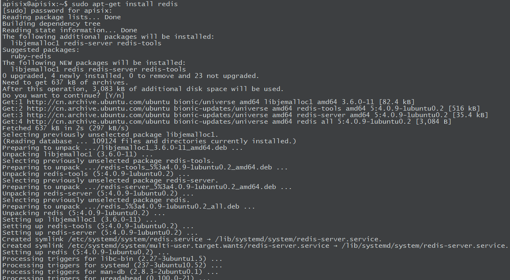
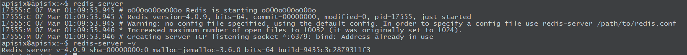
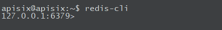

##### Redis简介
Redis是一个开源免费的，遵守BSD开源协议的，一个高性能的key-value数据库


##### Redis的优势
1. 性能高
Redis的读速度约为110000/s，写的速度约为81000/s

2. 丰富的数据类型
Redis有着丰富的数据类型，例如: String，Lists，Hashes，Sets和Order Sets等数据类型

3. 原子
Redis的**所有操作都是原子的**，同时Redis还支持对几个操作全并发的原子性执行

4. 丰富的特性
Redis支持**publish/subscribe**，通知key过期等等特性

5. 支持数据的持久化
Redis支持数据的持久化，**可以将内存的数据保持在磁盘中**，重启的时候可以再次加载进行使用

6. 支持数据的备份
Redis支持数据的备份，即master-salve模式的备份


##### Redis的安装
1. 从源码安装Redis
```bash
wget https://download.redis.io/releases/redis-6.2.6.tar.gz

tar xzf redis-6.2.6.tar.gz

cd redis-6.2.6/

make
```

2. 从Debian/Ubuntu官方APT仓库安装Redis
```bash
curl -fsSL https://packages.redis.io/gpg | sudo gpg --dearmor -o /usr/share/keyrings/redis-archive-keyring.gpg

echo "deb [signed-by=/usr/share/keyrings/redis-archive-keyring.gpg] https://packages.redis.io/deb $(lsb_release -cs) main" | sudo tee /etc/apt/sources.list.d/redis.list

sudo apt-get update

sudo apt-get install redis
```

3. 从Ubuntu PPA仓库安装Redis
```bash
sudo add-apt-repository ppa:redislabs/redis

sudo apt-get update

sudo apt-get install redis
```

4. 从snap应用商店安装Redis
```bash
sudo snap install redis
```

5. Arch Linux/Manjaro安装Redis
```bash
sudo pacman -S redis
```


##### 实战在Ubuntu18.04上安装redis
1. 更新软件源并安装



2. 启动redis-server服务端程序(默认情况下会自动开启)



3. 客户端连接Redis服务




---
that's all