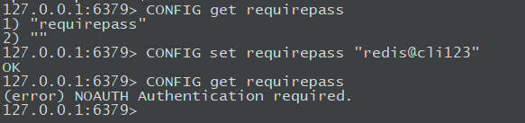

##### Redis安全
默认情况下，Redis登录时是不需要进行密码验证的，这样很不安全。
我们可以通过修改redis的配置文件，为其设置一个密码从而加强安全性，也可以通过命令行的方式为其设置登录密码

1. 查看redis是否设置了密码(默认为空)
```bash
127.0.0.1:6379 > COFNIG get requirepass
1) "requirepass"
2) ""
```

2. 为redis设置验证密码
```bash
127.0.0.1:6379 > CONFIG set requirepass "helloworld"
OK
```


##### 实战
1. 步骤一(其实是多部了,看图)


需要注意的是，在使用CONFIG set requirepass设置密码后，再查看时会报错，需退出，重新连接redis

2. 测试结果

  


---
that's all